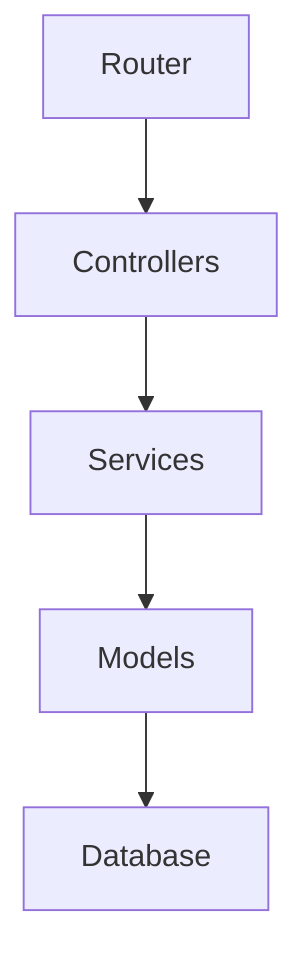

# مستند معماری و استانداردهای کدنویسی پروژه Chortke

این سند راهنمای رسمی برای توسعه‌دهندگان پلتفرم چرتکه است تا یکپارچگی معماری، امنیت بالا و عملکرد بهینه پروژه حفظ شود.

---

## ۱. ساختار لایه‌های معماری (Layered Architecture)

پروژه چرتکه بر اساس معماری لایه‌بندی شده توسعه یافته است. ارتباط بین لایه‌ها به صورت یک‌طرفه از بالا به پایین است:

### ۱.۱. لایه کنترلرها (Controllers)
* تمام کنترلرها باید از کلاس `\App\Controllers\BaseController` یا `\App\Controllers\User\BaseUserController` ارث‌بری کنند.
* وظیفه کنترلر **فقط** دریافت ورودی، احراز هویت اولیه، فراخوانی سرویس مناسب و بازگرداندن پاسخ است.
* **هیچ منطق تجاری (Business Logic)، ارتباط مستقیم با دیتابیس یا محاسبات مالی نباید در کنترلر انجام شود.**

### ۱.۲. لایه سرویس‌ها (Services)
* قلب منطق تجاری سیستم است.
* تمام سرویس‌ها **باید** از `\App\Services\BaseService` ارث‌بری کنند.
* تزریق وابستگی‌ها (Dependency Injection) باید از طریق سازنده (Constructor) انجام شود.
* لاگ‌گذاری به طور متمرکز از طریق `$this->logger` انجام می‌گردد.

### ۱.۳. لایه مدل‌ها (Models)
* مدل‌ها فقط مسئول تعامل با جداول پایگاه داده هستند.
* نباید هیچ‌گونه وابستگی به لایه‌های بالاتر (مانند سرویس‌ها) در مدل‌ها وجود داشته باشد.
* استفاده از `\Core\Container::getInstance()` در مدل‌ها **ممنوع** است.

---

## ۲. استانداردهای کدنویسی (Coding Standards)

* **نسخه PHP:** تمامی کدها باید با PHP 8.2+ و استاندارد `strict_types=1` سازگار باشند.
* **نام‌گذاری کلاس‌ها:** مطابق استاندارد PSR-4 به صورت PascalCase (مثال: `InvestmentService`).
* **نام‌گذاری متدها و متغیرها:** به صورت camelCase (مثال: `applyWeeklyProfitLoss`).
* **طول متدها:** حداکثر طول هر متد تجاری باید **زیر ۳۰ خط** باشد. در صورت طولانی شدن، باید به متدهای کوچک‌تر شکسته شود.

---

## ۳. امنیت و پیشگیری از آسیب‌پذیری‌ها

* **SQL Injection:** تمام کوئری‌ها باید از متدهای متصل پارامتری (Prepared Statements) استفاده کنند. هیچ پارامتر مستقیمی نباید درون رشته‌ی SQL الحاق (String Concat) شود.
* **XSS:** تمام خروجی‌ها در صفحات ویو باید با هلوپرهای ایمن انکود شوند.
* **تزریق وابستگی ایمن:** از فراخوانی سراسری کانتینر در بدنه متدها خودداری کرده و ترجیحاً از تزریق سازنده یا هلوپر استاندارد `app()` استفاده کنید.

---

## ۴. سیستم صف (Queue System)

* عملیات سنگین تجاری (مانند محاسبات سود هفتگی، ارسال ایمیل‌های انبوه و خروجی‌های گزارش‌گیری) نباید به صورت همزمان (Synchronous) پردازش شوند.
* این تسک‌ها باید با کلاس `\Core\Queue` درون صف ثبت شده و پردازش آن‌ها به پردازشگر پس‌زمینه در `cron.php` سپرده شود.
